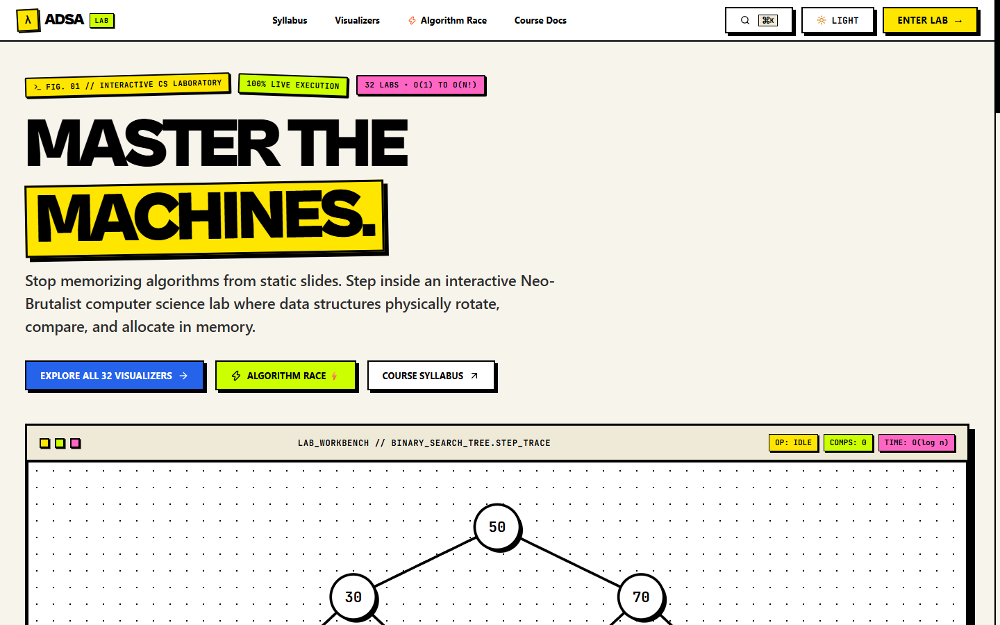
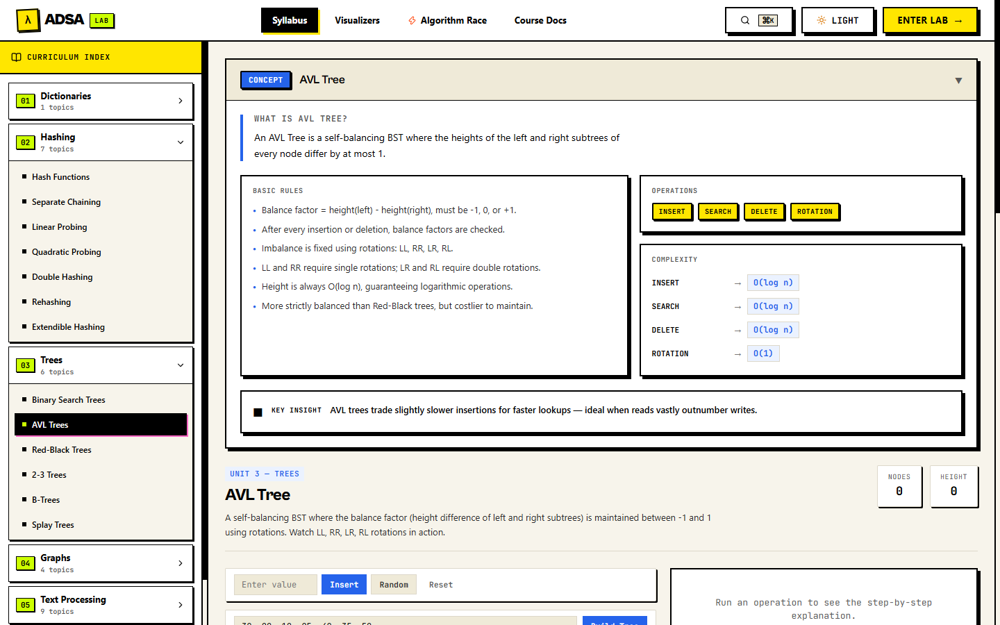
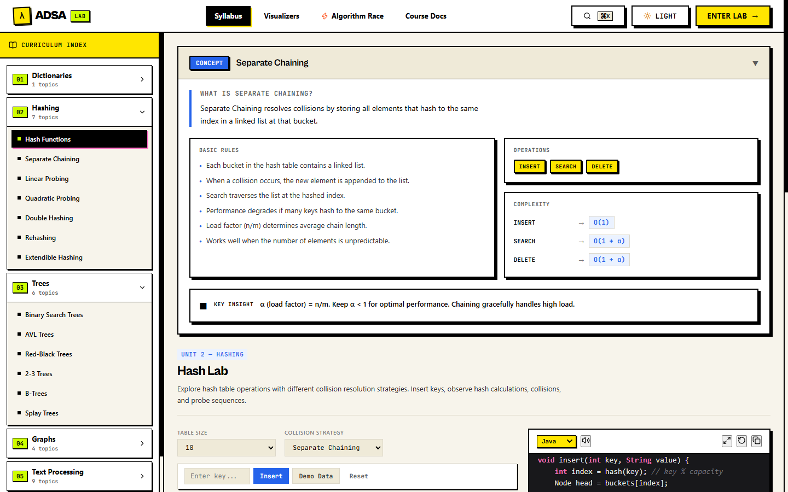
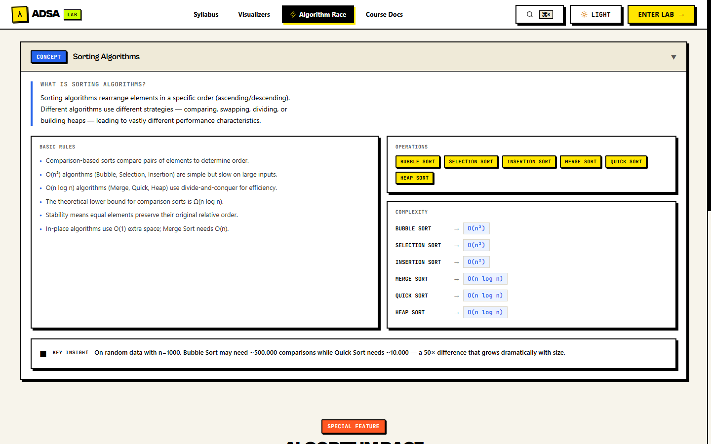

<div align="center">

# 🚀 ADSA Interactive Learning Lab

**A High-Contrast, Interactive Advanced Data Structures & Algorithms Visual Laboratory.**

[](https://temporary-prompt-marble-t9vkpmp.vercel.app)
[](https://react.dev/)
[](https://www.typescriptlang.org/)
[](https://vitejs.dev/)
[](LICENSE)
[](https://github.com/Yuvrajkale01)

[**✨ VIEW LIVE PROJECT ✨**](https://temporary-prompt-marble-t9vkpmp.vercel.app) • [**📂 GITHUB REPOSITORY**](https://github.com/Yuvrajkale01/ADSA-LAB)

<br/>



</div>

<br/>

---

## 🌟 Overview

**ADSA Interactive Learning Lab** is an educational platform engineered to transform abstract computer science concepts into tactile, real-time interactive simulations. Rather than memorizing theoretical operations from static textbook slides, learners actively manipulate balancing trees, inspect collision resolution probing sequences, simulate graph relaxations, explore string-matching automata, and analyze step-by-step state invariants with execution controls.

---

## 🎯 Purpose & Problem Statement

Traditional Advanced Data Structures and Algorithms (ADSA) curricula rely heavily on mathematical pseudo-code and static chalkboard diagrams. Consequently, students often struggle to develop spatial intuition for:
- Tree rotations during AVL and Red-Black tree rebalancing
- Memory clustering patterns during open-addressing hash collisions
- Shortest-path edge relaxations across priority queues
- State transitions in Boyer-Moore and Knuth-Morris-Pratt (KMP) pattern matching

**ADSA Visual Lab** bridges this gap by providing an experimental workbench where every operation is rendered as a living, inspectable data structure with instant visual feedback and complexity analysis.

---

## 📸 Visual Showcase

### Interactive AVL Self-Balancing Tree Workbench
> Step-by-step rotations (LL, RR, LR, RL) with real-time balance factor tracking and pseudocode alignment.


### Advanced Hashing & Collision Resolution
> Compare Separate Chaining against Linear Probing, Quadratic Probing, and Double Hashing under variable load factors.


### Head-to-Head Algorithm Race Arena
> Benchmark sorting and searching algorithms simultaneously with identical inputs, comparing operation cycles and runtimes.


---

## 🔥 Key Features

- 🎮 **Interactive Visual Workbenches**: Real-time manipulation of binary search trees, balanced trees, heaps, graphs, hash tables, and string matching automata.
- ⏯️ **Step-by-Step Execution Engine**: Play, pause, forward, backward, and variable execution speeds to inspect invariants at every atomic state transition.
- 🏎️ **Algorithm Race Mode**: Live side-by-side performance competitions comparing operation counts, array swaps, and wall-clock execution.
- 🧠 **Complexity Inspector**: Dynamic time and space complexity breakdowns (best, average, worst cases) with mathematical explanations.
- 📚 **Guided University Curriculum**: Comprehensive coverage of 6 core academic units from dictionary ADTs to advanced algorithm design paradigms.
- 🎨 **Neo-Brutalist Design System**: High-contrast, tactile, distraction-free visual aesthetics engineered for clarity and cognitive focus.
- 📱 **Universal Responsiveness**: Adaptive layouts featuring a consistent authorship footer on every route across desktop, tablet, and mobile screens.

---

## 🛠️ Modules Breakdown

| Module | Visualizations & Features |
| :--- | :--- |
| 🌳 **Balanced Trees & Heaps** | Binary Search Trees, AVL Trees (automated rotation visualizers), Red-Black Trees, 2-3 Trees / B-Trees, Splay Trees, Min/Max Priority Heaps. |
| 🗄️ **Advanced Hashing** | Hash function visualizers, collision strategies (Separate Chaining, Linear Probing, Quadratic Probing, Double Hashing), Rehashing, and Extendible Hashing. |
| 🕸️ **Graph Algorithms** | Breadth-First Search (BFS), Depth-First Search (DFS), Dijkstra's Shortest Path, Bellman-Ford, and Topological Sorting with interactive node editors. |
| 📝 **Text Processing** | Brute Force string matching, Knuth-Morris-Pratt (KMP), Boyer-Moore, Standard Tries, Compressed/Suffix Tries, Huffman Coding Tree bitstream generator, and Longest Common Subsequence (LCS). |
| 🧩 **Algorithm Design** | Sandboxes for Divide & Conquer, Greedy approaches, Dynamic Programming memoization tables, Backtracking (N-Queens), and Branch & Bound. |
| 🏁 **Algorithm Race** | Direct execution benchmark arena comparing iterations, comparisons, and memory utilization across multiple algorithms simultaneously. |

---

## 💻 Tech Stack

- **Frontend Core**: [React 19](https://react.dev/) + [TypeScript](https://www.typescriptlang.org/)
- **Bundler & Tooling**: [Vite](https://vitejs.dev/)
- **Motion & Dynamics**: [Framer Motion](https://www.framer.com/motion/)
- **Styling Architecture**: Pure Vanilla CSS Custom Tokens with Neo-Brutalist High-Contrast System
- **Icons**: [Lucide React](https://lucide.dev/)
- **Code Syntax Highlighting**: [React Syntax Highlighter](https://github.com/react-syntax-highlighter/react-syntax-highlighter)
- **Deployment & Hosting**: [Vercel](https://vercel.com/) with single-page application routing configuration

---

## 🏗️ Project Structure

```text
ADS-Aao-Dekho-Seekho-main/
├── docs/
│   └── screenshots/             # Real captured application screenshots
├── public/
│   ├── favicon.svg
│   └── icons.svg
├── src/
│   ├── algorithms/              # Pure algorithmic logic & state generator engines
│   │   ├── dictionaries/
│   │   ├── hashing/
│   │   ├── trees/               # AVL, BST, Red-Black, B-Tree, Heaps
│   │   ├── graphs/              # BFS, DFS, Dijkstra, Bellman-Ford
│   │   └── text/                # KMP, Boyer-Moore, Huffman, LCS
│   ├── components/
│   │   ├── layout/              # TopNav, Sidebar, and Global Authorship Footer
│   │   └── visualization/       # AnimationControls, ExplanationPanel, CodePanel
│   ├── data/                    # Curriculum data & academic course outcomes
│   ├── engine/                  # Core stepping & playback state machine
│   ├── hooks/                   # useTheme, useStateEngine, useResize
│   ├── pages/                   # Home, Dashboard, VisualizerHub, About
│   ├── styles/                  # Neo-brutalist variables & tokens
│   ├── visualizers/             # Interactive UI sandboxes for all 32+ topics
│   ├── App.tsx                  # Application shell & route configuration
│   └── main.tsx                 # React DOM entry point
├── LICENSE                      # MIT License with Yuvraj K. copyright notice
├── package.json                 # Project dependencies and npm scripts
├── vercel.json                  # Vercel SPA rewrite routing rules
└── vite.config.ts               # Vite configuration
```

---

## 🔗 Repository

The primary source repository is hosted on GitHub:

**[GitHub Repository](https://github.com/Yuvrajkale01/ADSA-LAB)**

```bash
git clone https://github.com/Yuvrajkale01/ADSA-LAB.git
```

---

## 🌐 Live Demo

The production application is deployed and live on Vercel:

**[View Live Project](https://temporary-prompt-marble-t9vkpmp.vercel.app)**

---

## 🚀 Getting Started Locally

### Prerequisites

- [Node.js](https://nodejs.org/) (version 18.0 or higher recommended)
- `npm` (bundled with Node.js) or `pnpm` / `yarn`

### Installation & Local Run

1. **Clone the repository**
   ```bash
   git clone https://github.com/Yuvrajkale01/ADSA-LAB.git
   cd ADSA-LAB
   ```

2. **Install dependencies**
   ```bash
   npm install
   ```

3. **Start the local development server**
   ```bash
   npm run dev
   ```
   Open your browser and navigate to `http://localhost:5173`.

### 🏗️ Build for Production

To create an optimized production build:

```bash
npm run build
```

To preview the production build locally:

```bash
npm run preview
```

---

## 👤 Author

**Created and designed by Yuvraj K.**

---

## ⚖️ Copyright & License

```text
© 2026 Yuvraj K. All rights reserved.
```

This project is licensed under the **[MIT License](LICENSE)**. All original UI designs, layout systems, educational visualizer architectures, and interactive laboratory implementations are authored and created by **Yuvraj K.**
